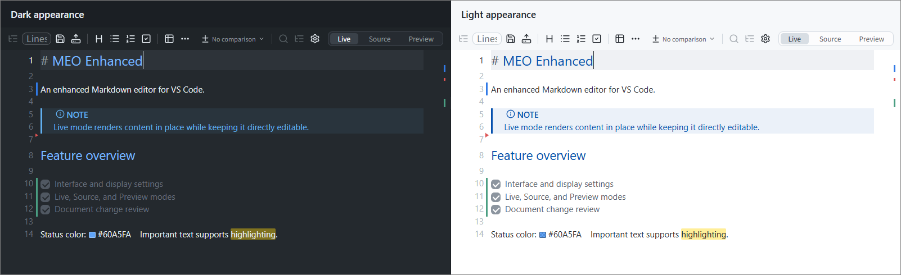
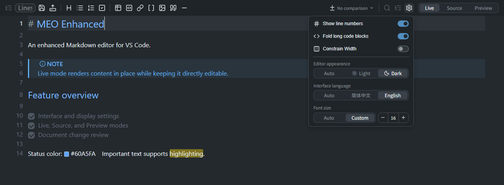
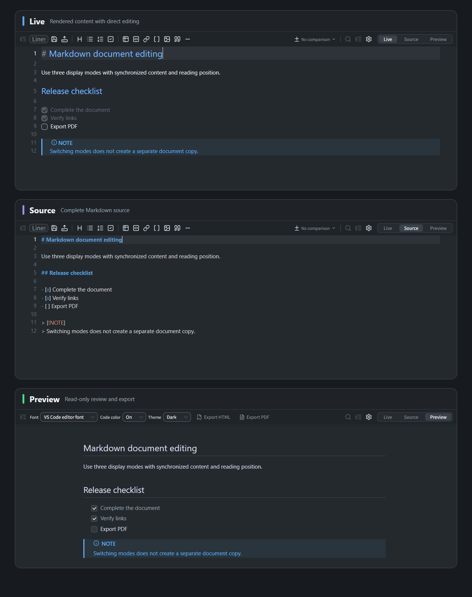
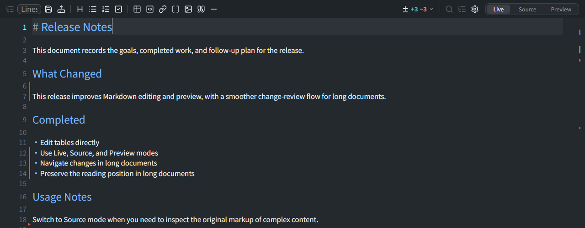
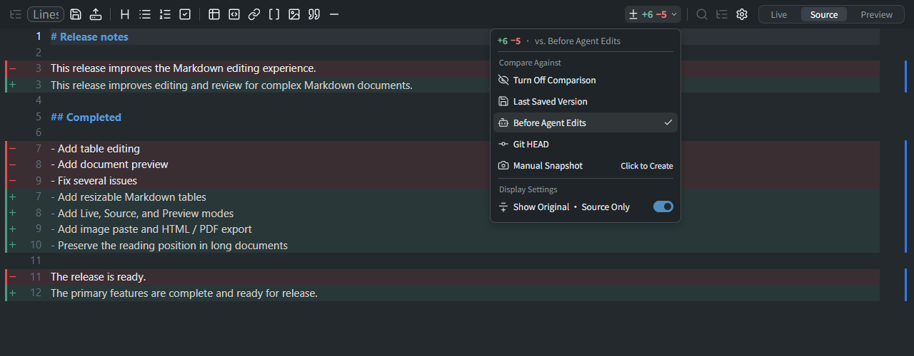
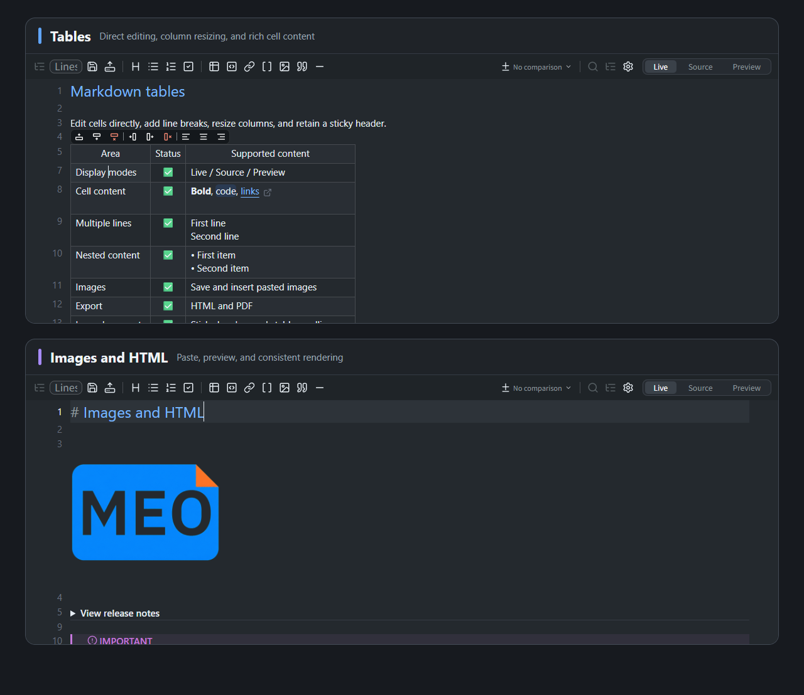
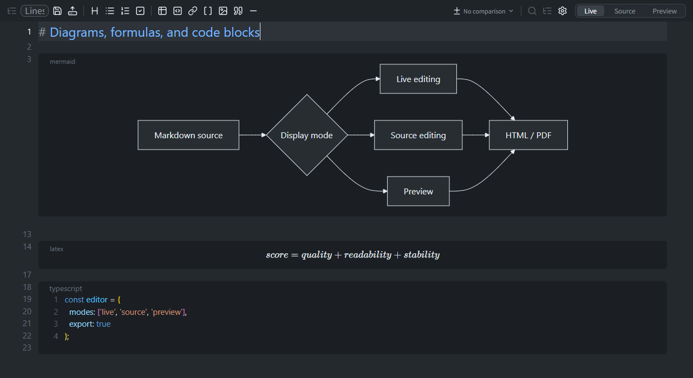

# MEO Enhanced

Write, preview, and review complex Markdown seamlessly in VS Code, switch freely between Live, Source, and Preview modes, and handle tables, Mermaid, LaTeX, HTML, and more with ease.

在 VS Code 中流畅编写、预览和审阅复杂 Markdown，随时切换实时、源码与预览模式，并轻松处理表格、Mermaid、LaTeX、HTML 等内容。

<p align="center">
  <strong>English</strong> · <a href="https://github.com/huangko555/meo-enhanced/blob/main/README.zh-CN.md">简体中文</a> · <a href="https://github.com/huangko555/meo-enhanced/blob/main/CONTRIBUTING.md">Contributing</a>
</p>

<p align="center">
  <a href="https://marketplace.visualstudio.com/items?itemName=huangko555.meo-enhanced"><strong>Install from VS Code Marketplace</strong></a> ·
  <a href="https://github.com/huangko555/meo-enhanced/releases">Download VSIX</a> ·
  <a href="https://github.com/huangko555/meo-enhanced/blob/main/CHANGELOG.md">Changelog</a>
</p>



MEO Enhanced is designed for users who write and review complex Markdown documents in VS Code. It brings Markdown source, rendered output, and version differences into one interface, reducing the need to switch between separate editors and preview windows.

## Interface and display settings

The toolbar and its settings panel provide the following options:

- **Interface language**: Simplified Chinese, English, or the current VS Code display language.
- **Editor appearance**: Light, Dark, or the current VS Code theme.
- **Content font size**: Follow the VS Code editor font size or use a custom size from `10` to `32`.
- **Preview settings**: Configure the Preview appearance, document font, and code colors independently.



## Three display modes

- **Live**: Displays rendered headings, lists, tables, images, diagrams, formulas, and other content in place while retaining direct editing.
- **Source**: Displays the complete Markdown source with syntax highlighting for precise markup changes, bulk editing, and inspection of the original content.
- **Preview**: Displays the fully rendered document in a read-only view, with controls for font, code colors, appearance, and export.

All three modes use the same document content. The current reading position is preserved when switching modes, without creating or maintaining a separate preview document.



## Document change review

Change review updates in real time as you edit, displaying additions, modifications, and deletions beside the editor and summarizing their counts in the toolbar. The overview ruler on the right shows how changes are distributed throughout the document, making them easy to locate in long files.



The following comparison baselines are available:

- **Last Saved Version**: Recommended for manual editing. Compares the current content with the most recent content saved to disk.
- **Before Agent Edits**: Recommended for agent editing. Shows changes produced by consecutive writes to disk.
- **Git HEAD**: Compares the current document with its version in the latest Git commit.
- **Manual Snapshot**: Captures the current document state and compares subsequent changes against it.

> **How does “Before Agent Edits” work?**
>
> Agent changes are written directly to disk, so they do not appear as unsaved content. This option therefore compares the current content with the preceding version saved to disk, showing the difference between two disk saves.
>
> Consecutive disk writes within 10 seconds are treated as one editing round and continue to use the version from before the first write in that round as the comparison baseline.
>
> If no preceding saved version is available, the most recently saved version is used as the baseline.

Source mode can display the previous content above modified lines. Consecutive content such as code blocks, tables, Mermaid diagrams, and formulas is grouped under the corresponding change marker so that each change can be reviewed in context.



## Markdown content support

### Tables

Markdown tables are displayed as interactive tables with support for:

- Direct cell editing.
- Adding or deleting rows and columns, and setting column alignment.
- Dragging to resize columns and retaining widths for the current session.
- Selecting and copying across multiple cells.
- Links, images, lists, code, and multiline content inside cells.
- A sticky header and editing toolbar for long tables.

### Images and HTML

Images can use local paths, workspace-relative paths, Windows absolute paths, or remote URLs. Images pasted from the clipboard can be saved automatically to a configured directory and inserted into the current document.

Supported safe inline and block HTML can be rendered in Live and Preview modes or switched to source for editing. The rendered output is also used for Preview, HTML export, and PDF export.



### Mermaid, LaTeX, and code blocks

Mermaid diagrams and block LaTeX formulas provide **Source**, **Split**, and **Preview** display options within the block. Users can switch between source, side-by-side, and rendered views and use zoom controls. Larger diagrams and formulas adapt to the available Preview and export area.

Code blocks support syntax highlighting, select all, copy, and folding for long code. Preview and exported documents can retain syntax colors.



### Other Markdown content

- Frontmatter Properties and source editing for complex YAML content.
- GitHub Alerts, footnotes, task lists, and blockquotes.
- Standard links, document anchors, and Wiki links.
- `==highlights==`, keyboard keys, color previews, and inline styles.
- Visual actions for merge conflict blocks.

## Install

Install **MEO Enhanced - Markdown Editor** from the [VS Code Marketplace](https://marketplace.visualstudio.com/items?itemName=huangko555.meo-enhanced), or run:

```shell
code --install-extension huangko555.meo-enhanced
```

After installation, open any `.md`, `.markdown`, `.mdx`, or `.mdc` file directly. You can also right-click a file and select **Open With MEO Enhanced**, or run **MEO Enhanced: Set as Default** from the Command Palette.

For offline installation, download a `.vsix` package from [GitHub Releases](https://github.com/huangko555/meo-enhanced/releases), then run **Extensions: Install from VSIX...** in VS Code.

## Compatibility

- Requires VS Code `1.97.0` or newer.
- Supports `.md`, `.markdown`, `.mdx`, and `.mdc` files.
- Can be installed alongside the original MEO extension; each extension uses independent editors, commands, and settings.

## Project origin

MEO Enhanced is based on [Markdown Editor Optimized (MEO)](https://github.com/vadimmelnicuk/meo). Editing is powered by [CodeMirror](https://codemirror.net/), with interaction design inspired by [Obsidian](https://obsidian.md/).

## License

[MIT License](LICENSE)
