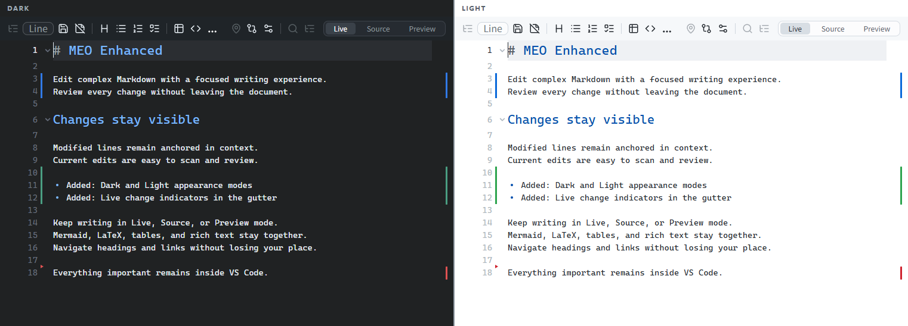
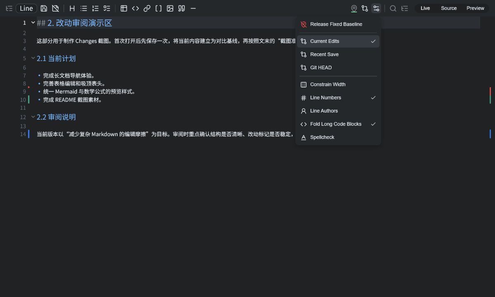
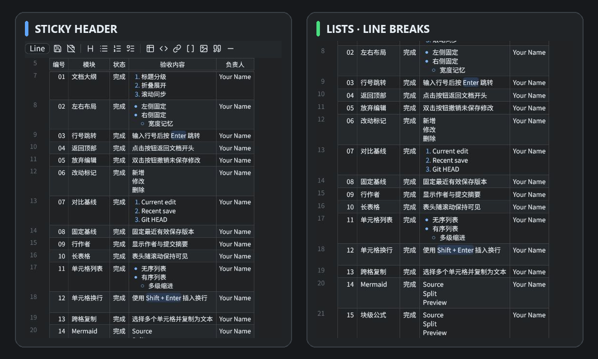
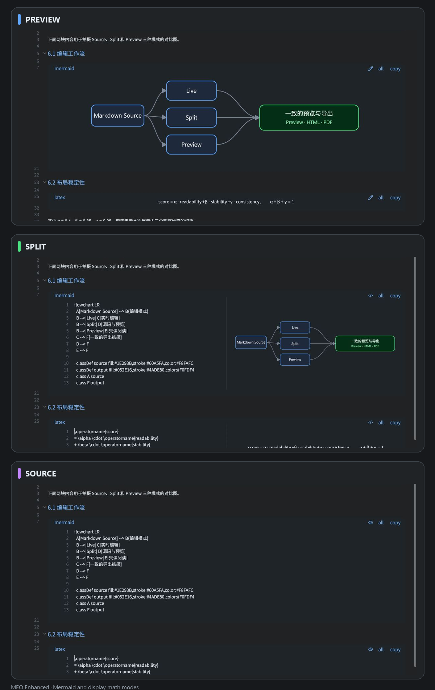

# MEO Enhanced

Edit complex Markdown and see every addition, modification, and deletion as you work—all inside VS Code.

在 VS Code 中编辑复杂 Markdown，并在工作过程中清楚看到每一处新增、修改与删除。

<p align="center">
  <a href="https://github.com/huangko555/meo-enhanced/blob/main/README.md">English</a> · <strong>简体中文</strong>
</p>

<p align="center">
  <a href="https://marketplace.visualstudio.com/items?itemName=huangko555.meo-enhanced">从 VS Code Marketplace 安装</a> ·
  <a href="https://github.com/huangko555/meo-enhanced/releases">下载 VSIX</a> ·
  <a href="https://github.com/huangko555/meo-enhanced/blob/main/CHANGELOG.md">查看变更记录</a> ·
  <a href="https://github.com/huangko555/meo-enhanced/blob/main/docs/theming.md">主题配置</a>
</p>



MEO Enhanced 是一款围绕稳定 Live 编辑工作流构建的 VS Code Markdown 编辑器。它把源码编辑、实时渲染、改动审阅、高级表格、Mermaid、LaTeX、图片和文档导航放进同一个编辑器，避免在互相割裂的视图之间来回切换。

项目基于 [Markdown Editor Optimized（MEO）](https://github.com/vadimmelnicuk/meo) 开发，重点增强大型文档和复杂结构文档的交互、审阅与布局稳定性。

## 安装

从 [VS Code Marketplace](https://marketplace.visualstudio.com/items?itemName=huangko555.meo-enhanced) 安装 **MEO Enhanced - Markdown Editor**，也可以执行：

```shell
code --install-extension huangko555.meo-enhanced
```

随后右键 `.md`、`.markdown`、`.mdx` 或 `.mdc` 文件，选择 **Open With MEO Enhanced**。如需设为默认 Markdown 编辑器，可在命令面板中执行 **MEO Enhanced: Set as Default**。

离线安装时，可从 [GitHub Releases](https://github.com/huangko555/meo-enhanced/releases) 下载 `.vsix`，然后执行 **Extensions: Install from VSIX...**。

## 编辑模式与外观

- **Live**：保持 Markdown 可直接编辑，同时在原位置渲染标题、表格、链接、图片、安全 HTML、提示块、代码块、Mermaid、LaTeX 等富内容。
- **Source**：提供专注的 Markdown 源码编辑体验，并保留语法高亮和文档导航能力。
- **Preview**：提供适合最终检查的只读渲染结果。
- **独立的 Dark 与 Light 外观**：可在 More 菜单底部手动切换。选择会立即应用到当前编辑器，并成为之后新打开编辑器的默认值，不会强制改变已经打开的其他编辑器。
- **一致的渲染与模式切换**：在 Live、Source 和 Preview 之间保持所选外观与阅读位置稳定。

## 在文档中直接审阅改动

MEO Enhanced 可以在文档旁直接显示新增、修改和删除状态，并通过概览标记展示它们在整个文件中的分布。

- 可与 **Current Edits**、**Recent Save** 或 **Git HEAD** 对比。
- 可将最近保存版本固定为基线，持续观察之后的改动。
- 无需打开独立 Diff 编辑器，即可预览删除内容并在改动位置之间移动。
- 可选显示修改行底色和 Git 行作者信息。
- 针对重复行、表格、连续删除和长文档优化改动标记稳定性。



## 编辑真实场景中的表格与嵌套内容

- 浏览长表格时，浮动表头会始终保留完整列信息。
- 可通过表格工具栏插入、删除、排序和选择行列。
- 在当前单元格中按 `Shift + Enter` 插入换行。
- 单元格内支持有序列表、无序列表、多级缩进、图片、颜色、行内格式和键盘标签。
- 可选择多个单元格，并使用 `Ctrl/Cmd + C` 复制为文本。
- 表格、代码块、Mermaid 和块级公式嵌套在列表等结构中时，仍能保持内容与控件对齐。



## 使用 Mermaid、LaTeX、代码、图片与 HTML

- Mermaid 和块级公式支持 **Source**、**Split** 与 **Preview** 三种块级显示模式。
- Split 模式支持拖动、缩放、重置和适应窗口，同时保留左侧源码和右侧渲染结果。
- 过宽的 Mermaid 和块级公式会在 Live、Preview 与导出结果中根据可用宽度缩放。
- 过长代码块可自动折叠；该功能默认启用，也可在 More 中关闭。
- 代码块支持行号、语法高亮、复制，以及一致的 Live、Preview 和导出样式。
- 图片支持剪贴板插入、稳定的本地路径处理、大图查看和通过系统应用打开。
- Frontmatter Properties 可以显示 Obsidian 风格的属性、标签和复杂 YAML 内容。
- Live 文本支持粗体、斜体、删除线、`==高亮==`、行内代码、键盘标签、链接、颜色和换行。
- 安全的行内与块级 HTML 会在 Live、Preview 和 HTML/PDF 导出中一致渲染，覆盖段落、对齐、链接、锚点、图片、列表、表格、引用、`<kbd>` 和 `<details>/<summary>`。
- HTML 渲染结果可切换为可编辑源码；危险属性和协议会被过滤，不支持或无效的内容则保留源码并显示提示。



## 导航并保持阅读位置

- 通过工具栏跳转到准确行号，或使用浮动按钮返回顶部。
- 使用两侧可调整宽度的层级大纲折叠、拖动和跟随章节。
- 编辑、保存、折叠、操作表格、渲染富内容或切换模式时，尽可能保持当前可见内容的位置不变。
- 双击放弃按钮，可丢弃当前文档的全部未保存修改。

## 常用操作

| 操作 | 使用方式 |
| --- | --- |
| 切换 Live 与 Source | `Alt/Option + Shift + M` |
| 跳转到指定行 | 在工具栏输入行号并按 `Enter` |
| 在表格单元格中换行 | `Shift + Enter` |
| 选择改动基线 | 打开 **More**，选择 Current Edits、Recent Save 或 Git HEAD |

## 配置与主题

编辑器提供独立的 Dark 与 Light 外观，以及可自定义的主题系统。主题选择器内置十套预设：One Monokai、One Dark Pro、Dracula、Gruvbox、Nord、Solarized Dark、Catppuccin Mocha、Tokyo Night、GitHub Dark 和 GitHub Light。

可以在命令面板中选择、导出、修改和导入主题。主题可控制文档配色、Markdown 与代码语法、字体排版、标题以及 HTML/PDF 导出样式。

完整结构、回退规则和语法颜色列表见[主题配置文档](docs/theming.md)。

常用设置包括：

- `meoEnhanced.outline.position`：将大纲放在左侧或右侧。
- `meoEnhanced.changes.baseline`：选择 `current-edit`、`recent-save` 或 `git-head` 作为对比基线。
- `meoEnhanced.gitChanges.visible`：显示或隐藏文档改动标记。
- `meoEnhanced.gitBlame.enabled`：悬停在行号附近时显示 Git 作者和提交信息。
- `meoEnhanced.codeBlocks.collapseLongBlocks`：启用或关闭过长代码块自动折叠。

## 兼容性与项目范围

- 需要 VS Code `1.97.0` 或更高版本。
- 通过自定义编辑器处理 `.md`、`.markdown`、`.mdx` 和 `.mdc` 文件。
- 与原版 MEO 使用不同的命令、设置和编辑器标识，因此可以同时安装。
- 本文以项目分叉时的上游 MEO `v0.1.26` 作为功能对比基准。
- 逐版本新增、修改、修复和移除内容请查看[变更记录](CHANGELOG.md)。

## 致谢

- [Markdown Editor Optimized](https://github.com/vadimmelnicuk/meo) — 原始项目
- [VS Code](https://code.visualstudio.com/) — 扩展平台
- [CodeMirror](https://codemirror.net/) — 编辑器核心
- [Obsidian](https://obsidian.md/) — 交互设计参考

## 许可证

[MIT License](LICENSE)
