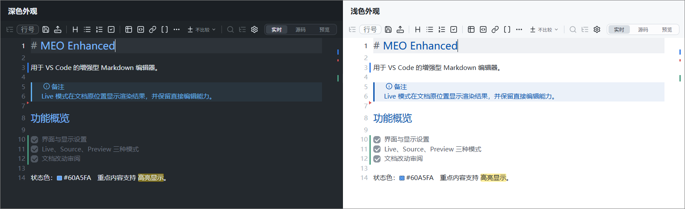
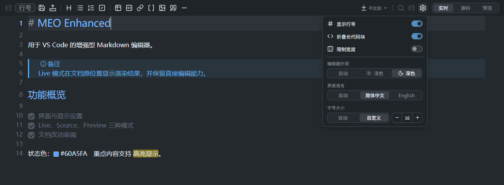
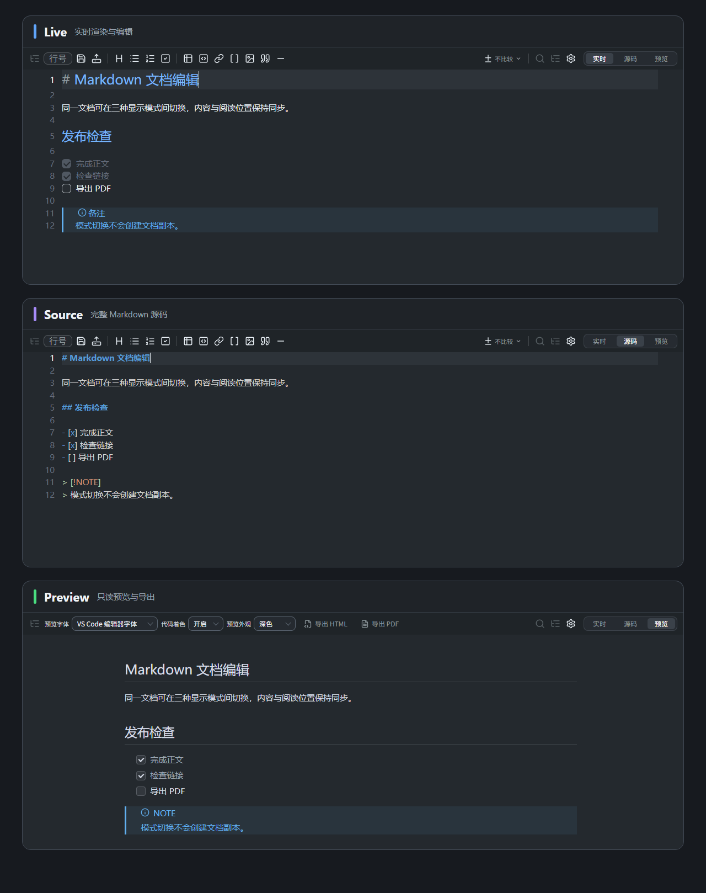
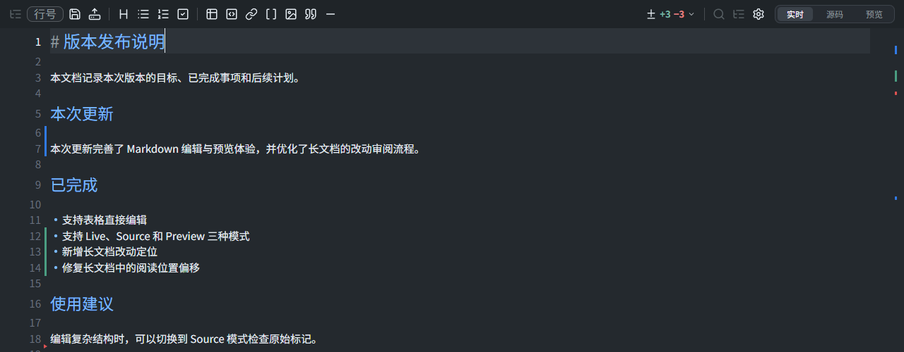
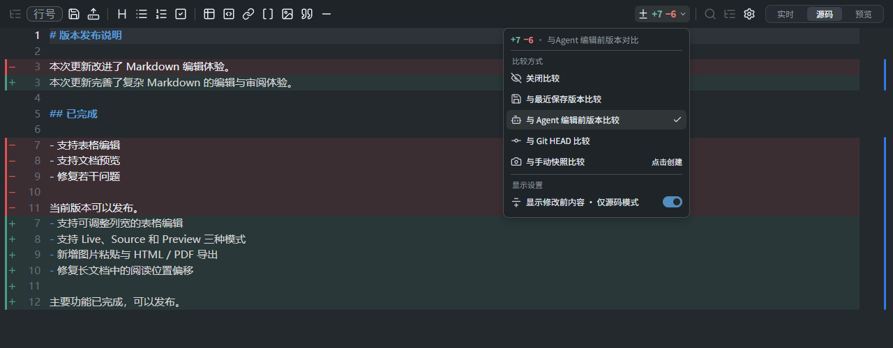
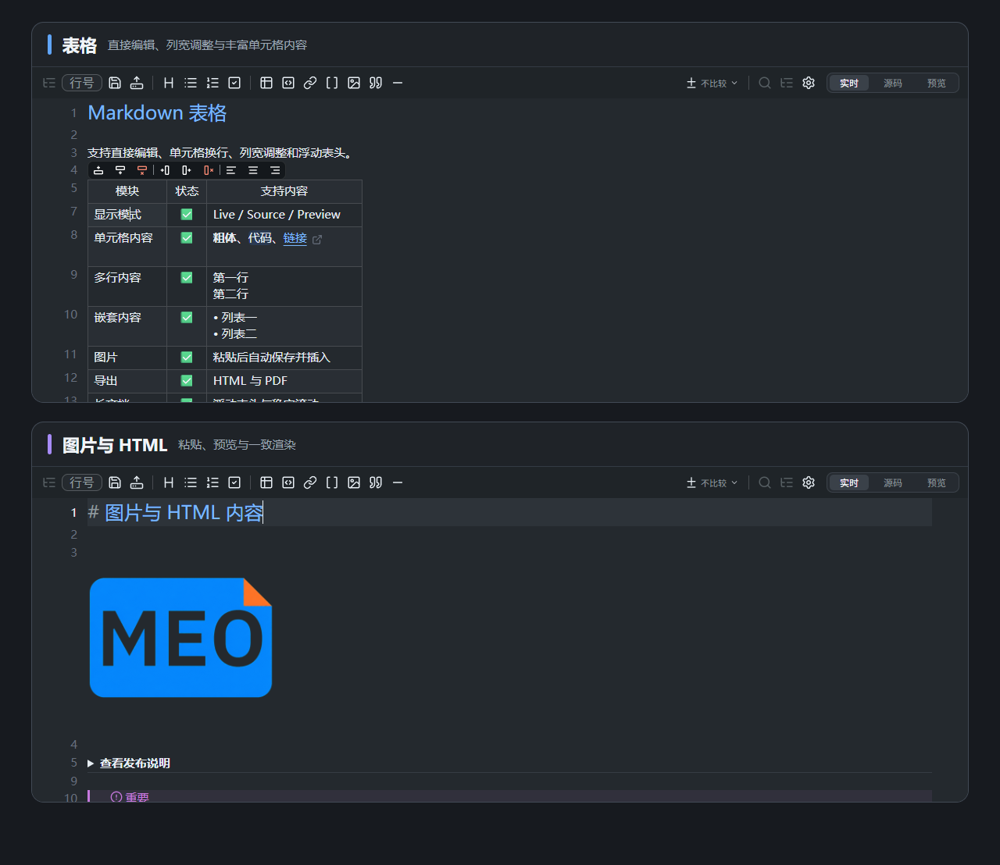
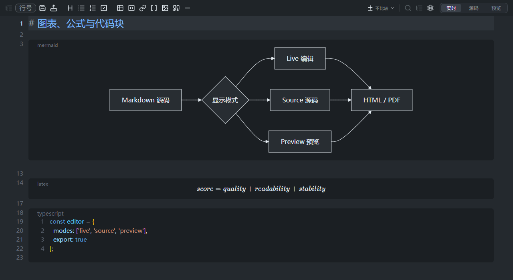

# MEO Enhanced

在 VS Code 中流畅编写、预览和审阅复杂 Markdown，随时切换实时、源码与预览模式，并轻松处理表格、Mermaid、LaTeX、HTML 等内容。

Write, preview, and review complex Markdown seamlessly in VS Code, switch freely between Live, Source, and Preview modes, and handle tables, Mermaid, LaTeX, HTML, and more with ease.

<p align="center">
  <a href="https://github.com/huangko555/meo-enhanced/blob/main/README.md">English</a> · <strong>简体中文</strong> · <a href="https://github.com/huangko555/meo-enhanced/blob/main/CONTRIBUTING.md">贡献指南</a>
</p>

<p align="center">
  <a href="https://marketplace.visualstudio.com/items?itemName=huangko555.meo-enhanced"><strong>从 VS Code Marketplace 安装</strong></a> ·
  <a href="https://github.com/huangko555/meo-enhanced/releases">下载 VSIX</a> ·
  <a href="https://github.com/huangko555/meo-enhanced/blob/main/CHANGELOG.md">变更记录</a>
</p>



MEO Enhanced 适用于需要在 VS Code 中编写和审阅复杂 Markdown 文档的用户。编辑器将 Markdown 源码、渲染结果和版本差异集中在同一界面中，减少不同编辑器和预览窗口之间的切换。

## 界面与显示设置

工具栏及其设置面板提供以下选项：

- **界面语言**：简体中文、English 或自动跟随 VS Code 显示语言。
- **编辑器外观**：浅色、深色或自动跟随当前 VS Code 主题。
- **内容字号**：跟随 VS Code 编辑器字号，或使用 `10` 至 `32` 的自定义字号。
- **Preview 设置**：独立选择预览外观、正文字体和代码着色方式。



## 三种显示模式

- **Live**：在文档原位置显示标题、列表、表格、图片、图表和公式等渲染结果，同时保留直接编辑能力。
- **Source**：显示完整 Markdown 源码和语法颜色，适用于精确修改标记、批量编辑和原始内容检查。
- **Preview**：以只读形式显示完整渲染结果，并提供预览字体、代码着色、亮暗外观和导出功能。

三种模式使用同一份文档内容。模式切换时会保留当前阅读位置，无需创建或维护单独的预览文档。



## 文档改动审阅

文档改动审阅会随编辑实时更新，在编辑器侧边显示新增、修改和删除标记，并在工具栏中汇总变更数量。右侧概览标记显示改动在全文中的分布，方便在长文档中快速定位。



支持以下比较基线：

- **最近保存版本**：手动编辑时推荐，比较当前内容与最近一次磁盘保存内容。
- **Agent 编辑前版本**：Agent 编辑时推荐，显示连续磁盘写入产生的改动。
- **Git HEAD**：比较当前文档与最新 Git 提交中的版本。
- **手动快照**：固定当前文档状态，并将后续改动与该状态比较。

> **“Agent 编辑前版本”如何工作？**
>
> Agent 的修改会直接写入磁盘，不会形成“未保存内容”。因此，该选项比较当前内容与更前一次的磁盘保存版本，显示两次磁盘保存之间的差异。
>
> 10 秒内连续发生的磁盘写入会视为同一轮修改，并继续使用这一轮首次写入前的版本作为比较基线。
>
> 如果没有更前一次的保存记录，则使用最近保存版本作为基线。

Source 模式可以在修改行上方显示修改前内容。代码块、表格、Mermaid 和公式等连续内容会合并显示对应的改动标记，便于结合完整结构进行审阅。



## Markdown 内容支持

### 表格

Markdown 表格以可交互形式显示，并支持以下操作：

- 直接编辑单元格内容。
- 增加或删除行列，设置列对齐方式。
- 拖动调整列宽，并在当前会话中保留宽度。
- 跨单元格选择和复制。
- 在单元格中使用链接、图片、列表、代码和多行内容。
- 在长表格中显示浮动表头和编辑工具栏。

### 图片与 HTML

图片支持本地路径、工作区相对路径、Windows 绝对路径和远程地址。从剪贴板粘贴图片时，文件可以自动保存到指定目录并插入当前文档。

受支持的安全行内 HTML 和块级 HTML 可以在 Live 与 Preview 中显示，也可以切换为源码进行修改。渲染结果会用于 Preview、HTML 导出和 PDF 导出。



### Mermaid、LaTeX 与代码块

Mermaid 图表和块级 LaTeX 公式提供 **Source、Split、Preview** 三种块内显示方式。内容可以在源码、分栏和渲染结果之间切换，并提供缩放控制。较大的图表和公式会根据 Preview 与导出区域调整显示尺寸。

代码块支持语法高亮、全选、复制和长代码折叠。Preview 与导出可以保留代码语法颜色。



### 其他 Markdown 内容

- Frontmatter Properties，以及复杂 YAML 内容的源码编辑。
- GitHub Alerts、脚注、任务列表和引用块。
- 普通链接、文档内锚点和 Wiki 链接。
- `==高亮==`、键盘按键、颜色值预览和行内样式。
- 合并冲突块的可视化操作。

## 安装

从 [VS Code Marketplace](https://marketplace.visualstudio.com/items?itemName=huangko555.meo-enhanced) 安装 **MEO Enhanced - Markdown 编辑器**，或在终端中执行：

```shell
code --install-extension huangko555.meo-enhanced
```

安装完成后，可直接打开 `.md`、`.markdown`、`.mdx` 或 `.mdc` 文件。也可以右键文件并选择 **使用 MEO Enhanced 打开**，或在命令面板中执行 **MEO Enhanced：设为默认编辑器**。

离线安装时，从 [GitHub Releases](https://github.com/huangko555/meo-enhanced/releases) 下载 `.vsix`，然后在 VS Code 中执行 **Extensions: Install from VSIX...**。

## 兼容性

- 需要 VS Code `1.97.0` 或更高版本。
- 支持 `.md`、`.markdown`、`.mdx` 和 `.mdc` 文件。
- 可以与原版 MEO 同时安装，两者使用独立的编辑器、命令和设置。

## 项目来源

MEO Enhanced 基于 [Markdown Editor Optimized（MEO）](https://github.com/vadimmelnicuk/meo) 开发。编辑功能使用 [CodeMirror](https://codemirror.net/) 实现，交互设计参考了 [Obsidian](https://obsidian.md/)。

## 许可证

[MIT License](LICENSE)
